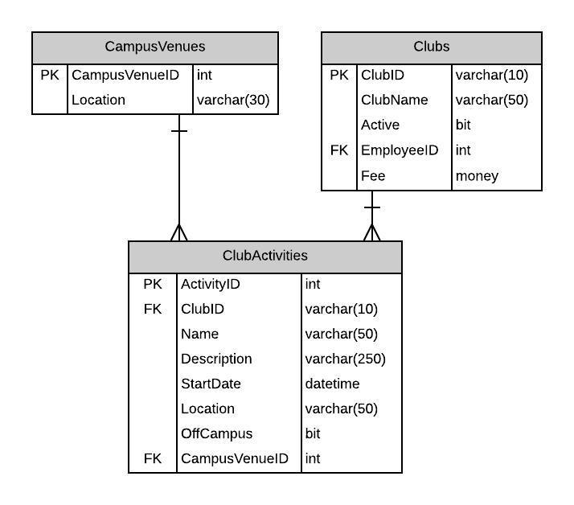

# A05: Club Activities

You must create two pages (Query and CRUD) based on the following database tables. You will create the entities by using reverse engineering.



## Query

> **ClubActivities by Date** - Search with Tabular Resuits

Display the results of looking up Club Activities starting on or after the supplied start date. Show the Club, Activity name and its date (see mock-up below). Display the club list in alphabetic order. The results will be displayed by start date. Restrict the date input control to accept only dates. This mock-up demonstrates pagination. Remember you may also use tabular scrolling to limit the number of lines displayed.

Future Deliverable Implementation Note: Add a selection column to each row for use during your CRUD processing. This link willl cause your CRUD page to appear.  Add a New button to go to your CRUD to add a new record.

- **Search Filter:**
  - Use a start date filter for main Club Activities lookup (find all activites for clubs since the start date):


## CRUD

> **ClubActivities** - Single Item Create/Read/Update/Delete

Note the following:

- Only future ClubActivities can be created, updated or deleted.
- ClubActivities' `StartDate` will default to Today if no start date is given when the activity is created.
- ClubActivities will have a CampusVenue assigned unless it is off campus. A CampusVenues `Location` list can be obtained from the database. Off campus flag is off (False) and the location is null. 
- Off campus activities must be flagged on (true) and have a location.
- The active must be either a campus activity OR a off campus activity
- 
**Queries**

Cluab List

```csharp
_context.Clubs
        .OrderBy(x => x.ClubName)
```

CampusVenus List

```csharp
_context.CampusVenues
        .OrderBy(x => x.Location)
```

Cluab Activity List by start date

```csharp
_context.ClubActivities
        .Where(x =>  x.StartDate >= startdate)
        .OrderBy(x => x.StartDate)
```

Cluab Activity List by activity id

```
csharp_context.ClubActivities
            .Where(x => x.ActivityId == activityid)
            .FirstOrDefault()
```

[Back to catalogue of scenarios](./ReadMe.md)
